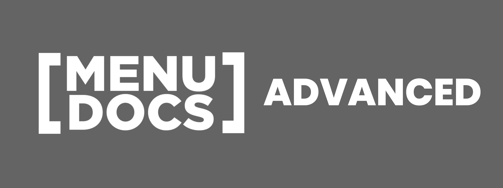

This Repository is dedicated to the display of JS/DJS knowledge. The code is showing what is possible with the [discord.js](https://discord.js.org/, 'Discord.JS Official Documentation') library and more.

# Links

Here are some links that are associated with `[MenuDocs] Advanced`  
[[MenuDocs] Discord](https://discord.gg/MgVaazZ, 'Link to the official Discord Server.')  
[[MenuDocs] Website](https://menudocs.org/, 'Link to the official Website.')  
[DefyCentral Discord](https://discord.gg/FHR2msy, 'Link to the 2D\'s guild.')  

## Information

YouTube might block your lavalink node because of yt searching, so i'm using simple-youtube-api to search youtube correctly.
*you should do the same*

Library's Used:

- **[discord.js-lavalink v3](https://npmjs.com/discord.js-lavalink, 'NPM Package download link') -** `for the lavalink client.`
- **[betalogger](https://npmjs.com/betalogger, 'NPM Package download link') -** `for the bot, music, & database logger.`
- **[discord.js](https://npmjs.com/discord.js, 'NPM Package download link') -** `for the connection to the discord api.`
- **[glob](https://npmjs.com/glob, 'NPM Package download link') -** `for the categorized commands directory support.`

## Credits

**Big thanks to [Duncan Sterkan](https://twitter.com/duncte123, 'Duncte123 - Twitter Account') for letting us use his lavalink node.**  
**Thanks to [2D](https://twitter.com/The2DPerson, 'The2DPerson - Twitter Account') for being smart enough to code this beast**  
**Thanks to [Connor Strand](https://twitter.com/Strandable, 'Strandable - Twitter Account') for supporting this project.**  
